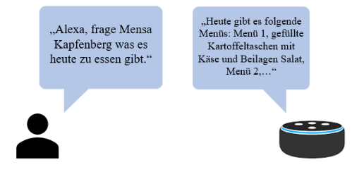
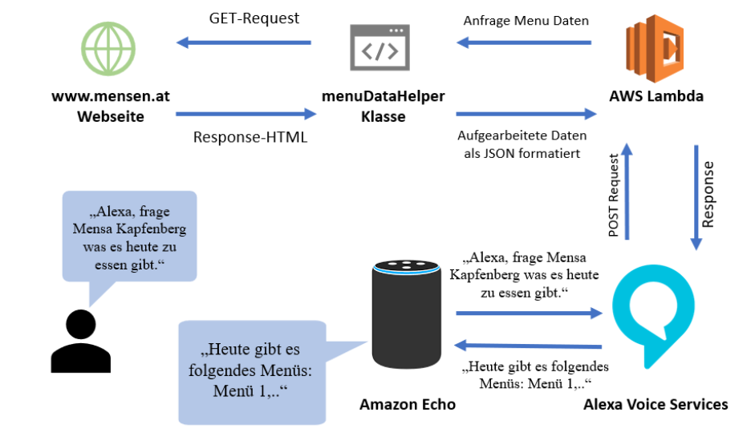

# Mensa Kapfenberg (Alexa Skill)
This alexa skill is part of my Bachelor Thesis 1 at the FH-Joanneum in 2019.

## Overview
This Alexa skill provides the daily menu plans for the cafeteria at the FH-JOANNEUM in Kapfenberg. It also supports the output of the cafeteria opening hours, information about the allergens contained in the menus and the associated menu prices. The skill can be used on any Amazon Alexa-enabled device.

## Feature Overview
- Get Menu Details for today / tomorrow / next week / next "weekday"
- Get allergene details for a specfic menu
- Get the opening hours of the cafeteria at the FH in Kapfenberg
- Get the price for a specfic menu
- Supports german language input only

## Try it out
Get the alexa skill at https://www.amazon.de/dp/B07XL824FZ

## Architecture Overview

